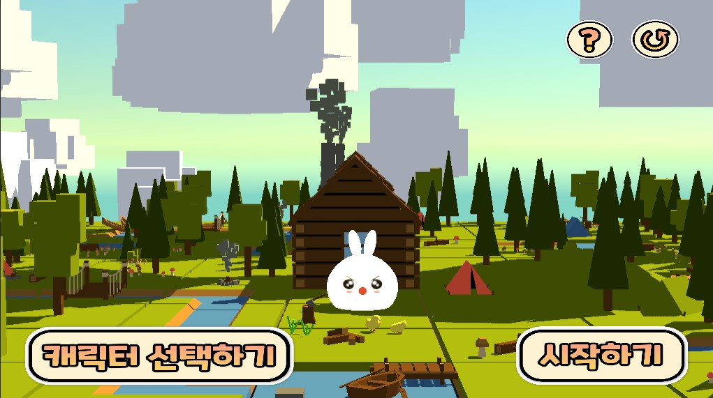

# 좌우명
 <mark>운명은 남이 개척하는 것이 아닌, 내가 개척하는 것이다.</mark>

# 인적사항

 
## 이름: 이은비
## 생년월일:2001.03.29

## 주소: 경기도 남양주시 화도읍 녹촌로

 

# 학력
  - 학교: 한림대학교
  - 전공: 소프트웨어학부 콘텐츠IT
   - 부전공: 식품영양학

# 연락처
  - Phone: 010-5274-9498
  - 메일 : leeub0329@naver.com
  - 블로그 :[blog](https://blog.naver.com/leeub0329)
# 취미
- 카페 공부
- 게임 분석
- 쿠기 만들기
- 롱보드
- 책 읽기

# 동아리
 씨애랑
 - SW 전시회
 - 하계 방학 워크숍
 ## 전시회 프로젝트 
  - [여우의 모험] 게임
   1. 장애물 피하기
   2. 곰 오래 피해다니기
   3. 토끼 사냥하기
   
# 공모전
## KBC 공모전
 {: width="400" height="380"}
 - 환경 보호를 주제로한 게임 프로젝트 
 ### 미니게임 & 퀴즈
   - 식물 키우기 게임
   - 분리수거 게임
   - 미로찾기 게임
   - 쓰레기 줍기 게임
   - 환경 기본 상식 게임
   - 전기 절약하기 시뮬레이션
   - 공기 정화 매트리스 게임

# 언어
 - C# , 유니티
 - java
 - C 언어
 - 리눅스
 

